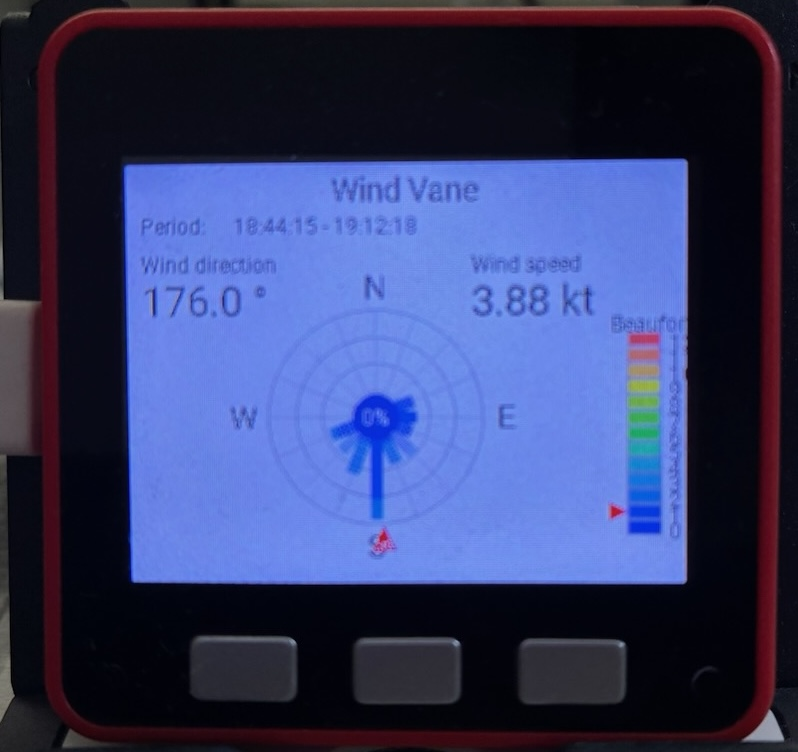

# ESPHome Windrose para M5Stack Fire

Uso de un M5Stack Fire para presentar datos meteorológicos de Home Assistant.

Diseño basado en la tarjeta de Home Assistant https://github.com/aukedejong/lovelace-windrose-card

## 1. Configura las entidades

En `m5-stack-fire-windrose.yaml`, ajusta las entidades de `substitutions`:

```yaml
substitutions:
  wind_direction_entity: sensor.ecowitt_wind_direction
  wind_speed_entity: sensor.ecowitt_wind_speed
  temperature_entity: sensor.ecowitt_outdoor_temperature
  humidity_entity: sensor.ecowitt_humidity
  rain_rate_entity: sensor.ecowitt_rain_rate
  rain_today_entity: sensor.ecowitt_rain_today
  rain_total_entity: sensor.ecowitt_rain_total
```

Usa los `entity_id` reales de Home Assistant. La pantalla espera temperatura
en °C, humedad en %, y lluvia (tasa, acumulado diario y acumulado total) en
mm/h o mm, respectivamente.

## 2. Pantallas y botones

Los tres botones físicos seleccionan una pantalla y actualizan el display al
instante:

| Botón | Pantalla |
| --- | --- |
| A | Rosa de los vientos original |
| B | Temperatura y humedad, con gráfica de las últimas 72 muestras válidas |
| C | Tasa de lluvia, acumulado diario y acumulado total |

Las muestras climáticas se toman cada 17 segundos mientras la API de Home
Assistant está conectada. Los botones dejan de ajustar el brillo para poder
dedicarse por completo a la navegación; la retroiluminación permanece
encendida como antes.

## 3. Empareja el dispositivo con Home Assistant

Los sensores `platform: homeassistant` solo reciben valores cuando Home Assistant esta conectado al dispositivo por la Native API de ESPHome.

Si usas cifrado, el bloque debe quedar asi:

```yaml
api:
  encryption:
    key: !secret m5_stack_fire_encryption_key
```

Y en `secrets.yaml` debe existir esa clave:

```yaml
m5_stack_fire_encryption_key: "TU_CLAVE_GENERADA"
```

Despues de compilar y subir el firmware:

1. Ve a Home Assistant > Ajustes > Dispositivos y servicios.
2. Anade o reconfigura la integracion ESPHome para `m5-stack-fire.local` o la IP del dispositivo.
3. Cuando Home Assistant pida la encryption key, pega la misma clave.
4. Si había una integración anterior sin cifrado o con otra clave, reconfigurala o eliminala y vuelve a anadirla.


